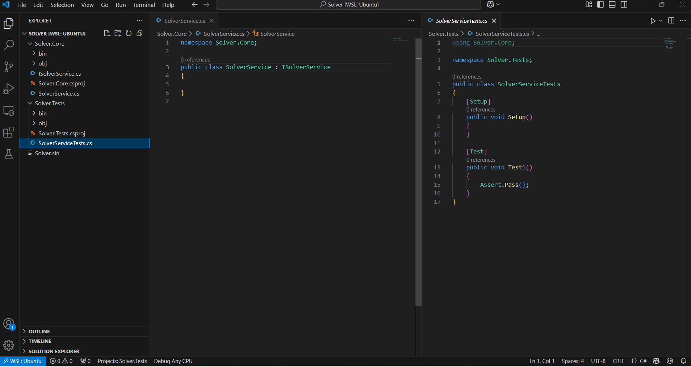

## SETUP SCRIPT

This is a simple bash script that simplifies standing up a new .NET solution with basic scaffolding. It's easy to do via the IDE, but I found myself having to do it over and over for simple solutions. So, I wrote a script to do it.

## USAGE

This script accepts a single parameter: a short name for your solution. Here's a basic example:

```bash
bash setup_dotnet.sh "Solver"
```

## WHAT THIS SCRIPT DOES

This script will:
- Create a new directory called `<yourName>` for your solution
- Create a new .sln with the name you provide: `<yourName>.sln`
- Create a new class library called `<yourName>.Core`
- Add `<yourName>.Core.csproj` to your new solution
- Create a new NUnit project called `<yourName>.Tests.csproj`
- Add `<yourName>.Tests.csproj` to your new solution
- Add a reference to `<yourName>.Core` in the dependencies to `<yourName>.Tests`
- Add an interface called `I<yourName>Service` to `<yourName>.Core` in the default namespace
- Rename `<yourName>.Core/Class1.cs` to `<yourName>.Core/<yourName>Service.cs`, rename the class within the file, and have it implement the interface from the previous step
- Rename `<yourName>.Tests/UnitTest1.cs` to `<yourName>.Tests/<yourName>ServiceTests.cs`, rename the class within the file, and include the `using` reference to `<yourName>.Core` within this file
- Open up the new `<yourName>` folder in VS Code

### SAMPLE OUTPUT

Using the "Solver" name from the example above, the output would look like this in VS Code:

